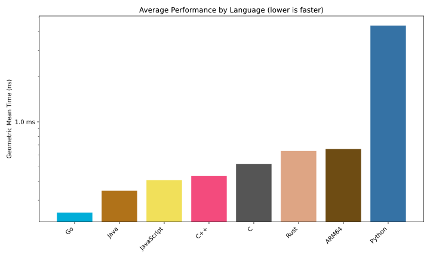
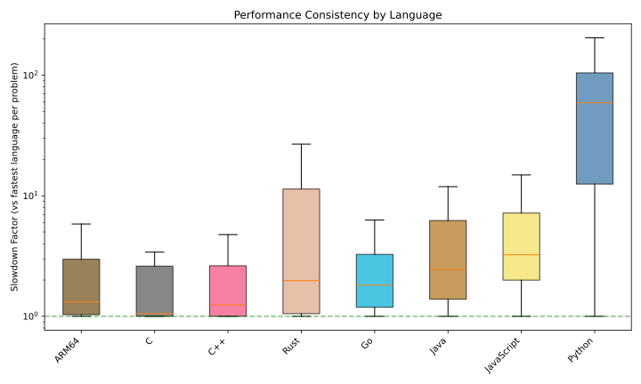
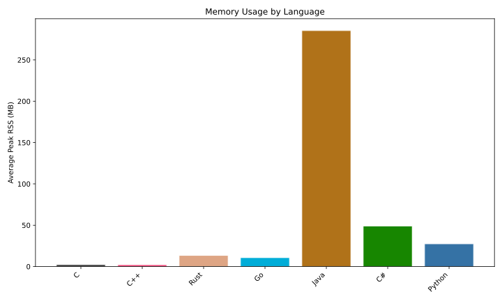
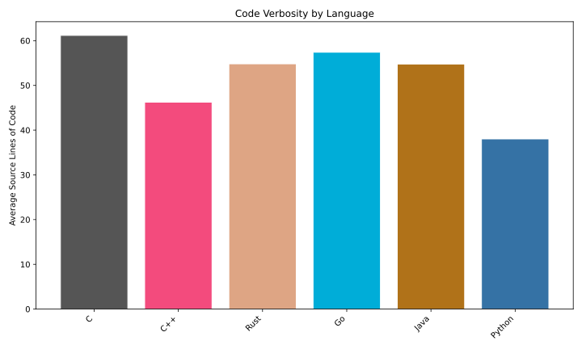

# Cross-Language Benchmark Results

Comparing 8 languages across 100 Project Euler problems.

Platform: Apple Silicon | Generated by aggregate.py

## Overall Rankings (by geometric mean time)

| Rank | Language | Geo. Mean Time | Problems |
|------|----------|----------------|----------|
| 1 | **Go** | 248.2 us | 99 |
| 2 | **Java** | 347.7 us | 99 |
| 3 | **JavaScript** | 409.8 us | 100 |
| 4 | **C++** | 435.6 us | 90 |
| 5 | **C** | 523.2 us | 78 |
| 6 | **Rust** | 639.9 us | 93 |
| 7 | **ARM64** | 660.7 us | 82 |
| 8 | **Python** | 4.4 ms | 95 |

## Memory Usage (Peak RSS)

| Language | Avg Peak RSS | Min | Max |
|----------|-------------|-----|-----|
| **C** | 2.6 MB | 1.2 MB | 49.0 MB |
| **C++** | 2.2 MB | 1.2 MB | 39.5 MB |
| **Rust** | 13.5 MB | 1.3 MB | 955.2 MB |
| **Go** | 10.8 MB | 3.7 MB | 157.7 MB |
| **Java** | 249.4 MB | 41.4 MB | 4908.6 MB |
| **Python** | 27.3 MB | 11.8 MB | 394.8 MB |

## Code Size (Source Lines of Code)

| Language | Avg SLOC | Total SLOC | Avg Bytes |
|----------|----------|------------|-----------|
| **C** | 61 | 6118 | 1542 |
| **C++** | 46 | 4579 | 1167 |
| **Rust** | 55 | 5482 | 1406 |
| **Go** | 57 | 5741 | 1122 |
| **Java** | 55 | 5423 | 2120 |
| **Python** | 38 | 3613 | 1210 |

## Per-Problem Comparison

| # | ARM64 | C | C++ | Rust | Go | Java | JavaScript | Python |
|---|---|---|---|---|---|---|---|---|
| 001 | 1.0 us | — | — | 708 ns | **41 ns** | 2.3 us | 166 ns | 416 ns |
| 002 | — | — | — | — | **41 ns** | 125 ns | 83 ns | 750 ns |
| 003 | — | 416 ns | 27.9 us | 28.8 us | **375 ns** | 709 ns | 12.2 us | 7.7 ms |
| 004 | 2.0 us | 2.0 us | 29.2 us | 13.2 us | **1.6 us** | 53.3 us | 2.7 us | 56.7 ms |
| 005 | — | **83 ns** | **83 ns** | **83 ns** | 125 ns | 250 ns | 167 ns | 9.4 us |
| 006 | — | — | — | — | **41 ns** | 83 ns | 83 ns | 3.9 us |
| 007 | 279.0 us | 160.5 us | **3.8 us** | 852.5 us | 275.6 us | 270.8 us | 300.8 us | 1.3 ms |
| 008 | **1.0 us** | — | 2.3 us | 4.1 us | 1.5 us | 2.8 us | 3.6 us | 874.5 us |
| 009 | — | **125 ns** | 167 ns | 114.2 us | 167 ns | 500 ns | 542 ns | 4.8 ms |
| 010 | 4.7 ms | 2.0 ms | **232.8 us** | 2.0 ms | 3.9 ms | 4.4 ms | 6.0 ms | 23.9 ms |
| 011 | 1.0 us | — | **333 ns** | — | 1.5 us | 5.5 us | 5.0 us | 214.5 us |
| 012 | 65.8 ms | **37.4 ms** | 37.5 ms | 38.7 ms | 39.1 ms | 41.2 ms | 74.8 ms | 1.57 s |
| 013 | **1.0 us** | — | 10.1 us | 18.0 us | 34.1 us | 26.8 us | 8.5 us | 1.9 us |
| 014 | 185.5 ms | **137.2 ms** | 164.4 ms | 183.2 ms | 168.4 ms | 226.3 ms | 2.06 s | 6.38 s |
| 015 | — | — | — | — | **83 ns** | 125 ns | 166 ns | **83 ns** |
| 016 | 361.0 us | 340.3 us | 402.0 us | 26.0 us | 446.3 us | 12.2 us | **1.9 us** | 21.5 us |
| 017 | 2.0 us | **1.3 us** | 218.5 us | 235.2 us | 2.4 us | 2.9 us | 2.5 us | 164.3 us |
| 018 | — | 83 ns | 84 ns | **42 ns** | 125 ns | 500 ns | 875 ns | 12.4 us |
| 019 | 4.0 us | — | **3.2 us** | 4.7 us | 4.0 us | 10.8 us | 5.0 us | 135.7 us |
| 020 | 15.0 us | 17.6 us | 18.3 us | 16.2 us | **1.9 us** | 9.2 us | 3.9 us | 11.5 us |
| 021 | 1.7 ms | 1.1 ms | 1.2 ms | 1.4 ms | 1.2 ms | **1.1 ms** | 2.0 ms | 26.2 ms |
| 022 | 1.0 ms | **80.0 us** | — | 523.8 us | 530.6 us | 1.7 ms | 997.2 us | 2.5 ms |
| 023 | 11.0 ms | **7.2 ms** | 30.1 ms | 82.4 ms | 10.1 ms | 8.9 ms | 14.1 ms | 595.2 ms |
| 024 | — | — | **42 ns** | 83 ns | **42 ns** | 208 ns | 333 ns | 2.0 us |
| 025 | 6.1 ms | 4.8 ms | 4.6 ms | 6.0 ms | **72.6 us** | 68.2 ms | 162.1 us | 22.7 ms |
| 026 | 786.0 us | **479.7 us** | 504.8 us | 4.1 ms | 927.7 us | 497.1 us | 761.6 us | 7.7 ms |
| 027 | 6.6 ms | **4.5 ms** | 9.0 ms | 6.4 ms | 5.6 ms | 5.8 ms | 16.0 ms | 414.6 ms |
| 028 | — | — | — | 666 ns | **416 ns** | 1.1 us | 1.2 us | 32.5 us |
| 029 | 57.5 ms | 69.1 ms | 69.9 ms | 63.5 ms | 6.0 ms | **1.7 ms** | 4.5 ms | 2.6 ms |
| 030 | 1.3 ms | **1.1 ms** | 1.1 ms | 1.9 ms | 1.6 ms | 3.5 ms | 4.0 ms | 217.1 ms |
| 031 | 1.0 us | — | **500 ns** | 1.3 us | 1.4 us | 2.8 us | 1.8 us | 42.2 us |
| 032 | **1.1 ms** | 12.3 ms | 6.5 ms | 13.4 ms | 16.7 ms | 3.1 ms | 4.4 ms | 43.3 ms |
| 033 | 7.0 us | — | 6.5 us | **5.0 us** | 5.7 us | 5.4 us | 6.9 us | 341.3 us |
| 034 | 11.0 ms | **9.2 ms** | 9.3 ms | 9.9 ms | 13.8 ms | 30.5 ms | 33.7 ms | 1.76 s |
| 035 | 1.7 ms | **1.7 ms** | 4.2 ms | 28.8 ms | 3.2 ms | 3.5 ms | 5.0 ms | 101.6 ms |
| 036 | **4.3 ms** | 56.7 ms | 64.0 ms | 87.1 ms | 42.4 ms | 32.4 ms | 62.2 ms | 150.6 ms |
| 037 | **1.3 ms** | 1.4 ms | 2.9 ms | 2.0 ms | 2.5 ms | 2.7 ms | 3.9 ms | 78.0 ms |
| 038 | 1.4 ms | 1.4 ms | **417.8 us** | 1.4 ms | 774.0 us | 585.2 us | 457.1 us | 4.0 ms |
| 039 | 1.9 ms | 83.7 us | 84.2 us | **83.1 us** | 86.1 us | 98.1 us | 100.6 us | 9.0 ms |
| 040 | 7.8 ms | 8.0 ms | 3.0 ms | 7.5 ms | 3.4 ms | **1.3 ms** | 3.9 ms | 17.6 ms |
| 041 | 6.7 ms | 6.2 ms | 17.6 ms | 6.2 ms | 10.4 ms | 11.8 ms | 11.8 ms | **51.1 us** |
| 042 | 18.0 us | 18.3 us | **11.8 us** | 60.7 us | 37.5 us | — | 47.1 us | 800.2 us |
| 043 | — | — | 12.8 ms | **10.0 ms** | 20.8 ms | 15.7 ms | 35.8 ms | 944.2 ms |
| 044 | 86.7 ms | 50.9 ms | 42.3 ms | **16.1 ms** | 169.0 ms | 25.2 ms | 57.4 ms | 166.7 ms |
| 045 | 60.0 us | 37.5 us | 39.3 us | **35.8 us** | 50.7 us | 43.6 us | 72.0 us | 3.7 ms |
| 046 | 3.0 ms | **2.8 ms** | 154.6 ms | 4.4 ms | 4.1 ms | 4.8 ms | 8.4 ms | 21.0 ms |
| 047 | **6.0 ms** | 6.0 ms | 95.7 ms | 6.3 ms | 6.1 ms | 6.9 ms | 10.0 ms | 404.5 ms |
| 048 | 117.0 us | **113.5 us** | 20.1 ms | 121.1 us | 350.9 us | 1.2 ms | 498.1 us | 659.3 us |
| 049 | 121.1 ms | 120.3 ms | **146.0 us** | 19.8 ms | 28.5 ms | 10.6 ms | 48.2 ms | 79.1 ms |
| 050 | 2.7 ms | 2.6 ms | 3.5 ms | **2.5 ms** | 3.9 ms | 4.2 ms | 5.0 ms | 107.0 ms |
| 051 | **378.0 us** | 380.0 us | 2.8 ms | 1.5 ms | 1.5 ms | 1.8 ms | 3.1 ms | 56.4 ms |
| 052 | 22.2 ms | 22.0 ms | 22.5 ms | 36.7 ms | 47.7 ms | **15.4 ms** | 78.3 ms | 103.5 ms |
| 053 | 6.0 us | **4.0 us** | 13.4 ms | 8.5 us | 13.2 us | 4.4 us | 10.9 us | 351.5 us |
| 054 | 420.0 us | 418.4 us | 1.0 ms | 416.4 us | 3.8 ms | **408.9 us** | 1.2 ms | 553.0 us |
| 055 | **1.4 ms** | — | — | 4.4 ms | 17.0 ms | 19.5 ms | 44.6 ms | 15.7 ms |
| 056 | 2.2 ms | 2.2 ms | 5.2 ms | **2.0 ms** | 3.6 ms | 10.5 ms | 49.9 ms | 54.6 ms |
| 057 | 931.0 us | — | 4.0 ms | **930.0 us** | 1.8 ms | 7.3 ms | 21.6 ms | 1.8 ms |
| 058 | 35.6 ms | — | 27.5 ms | 47.3 ms | 26.7 ms | **26.2 ms** | 51.9 ms | 911.1 ms |
| 059 | 1.9 ms | 1.9 ms | 2.0 ms | **1.8 ms** | 1.9 ms | 3.2 ms | 2.9 ms | 72.4 ms |
| 060 | 59.4 ms | **58.4 ms** | 1.20 s | 3.95 s | 69.8 ms | 417.6 ms | 340.4 ms | 35.38 s |
| 061 | 19.0 us | **18.9 us** | 20.5 us | 25.1 us | 25.5 us | 55.3 us | 71.0 us | 1.3 ms |
| 062 | **974.0 us** | 984.8 us | 1.3 ms | 1.7 ms | 3.1 ms | 1.4 ms | 6.8 ms | 5.9 ms |
| 063 | **1.0 us** | 1.4 us | 2.0 us | 2.5 us | 4.7 us | 15.4 us | 2.0 us | 5.8 us |
| 064 | 2.3 ms | **2.0 ms** | 2.0 ms | 2.0 ms | 2.1 ms | 2.0 ms | 2.2 ms | 25.1 ms |
| 065 | 26.0 us | 25.1 us | **3.1 us** | 25.4 us | 6.5 us | 9.0 us | 6.1 us | 14.6 us |
| 066 | 55.5 ms | 55.8 ms | **592.9 us** | 57.4 ms | 2.1 ms | 1.8 ms | 1.3 ms | 2.2 ms |
| 067 | 1.0 us | **875 ns** | 4.2 us | 62.2 us | 5.5 us | 136.0 us | 9.1 us | 367.0 us |
| 068 | 10.7 ms | 10.7 ms | **10.6 ms** | 11.2 ms | 19.5 ms | 24.2 ms | 38.9 ms | 959.8 ms |
| 069 | — | — | — | — | **41 ns** | 250 ns | 83 ns | 333 ns |
| 070 | 223.8 ms | 233.5 ms | 247.7 ms | **190.4 ms** | 290.5 ms | 430.3 ms | 784.9 ms | 11.64 s |
| 071 | 812.0 us | 1.9 ms | 1.9 ms | 1.9 ms | 1.9 ms | **701.3 us** | 1.6 ms | 74.7 ms |
| 072 | **3.2 ms** | 3.3 ms | 3.3 ms | 3.7 ms | 4.2 ms | 4.8 ms | 5.9 ms | 465.5 ms |
| 073 | 409.1 ms | 350.5 ms | **235.9 ms** | 355.6 ms | 355.6 ms | 386.2 ms | 450.7 ms | 952.7 ms |
| 074 | 5.0 ms | 5.0 ms | **679.8 us** | 33.1 ms | 6.5 ms | 13.3 ms | 13.4 ms | 633.8 ms |
| 075 | 4.5 ms | 4.5 ms | **3.8 ms** | 4.5 ms | 5.2 ms | 7.1 ms | 7.5 ms | 103.5 ms |
| 076 | 3.0 us | 2.5 us | 2.6 us | 4.1 us | 2.9 us | **2.3 us** | 4.5 us | 186.9 us |
| 077 | 20.0 us | **17.2 us** | 21.3 us | 24.2 us | 20.7 us | 23.6 us | 42.6 us | 827.0 us |
| 078 | 53.7 ms | **46.5 ms** | 47.1 ms | 46.6 ms | 47.0 ms | 48.2 ms | 124.5 ms | 1.09 s |
| 079 | — | **125 ns** | **125 ns** | 9.0 us | 250 ns | 2.0 us | 10.5 us | 31.0 us |
| 080 | — | — | 381.7 us | 9.4 ms | **253.2 us** | 2.6 ms | 373.4 us | 1.6 ms |
| 081 | 18.0 us | **5.2 us** | 8.5 us | 172.2 us | 9.9 us | 17.9 us | 433.6 us | — |
| 082 | 40.0 us | 13.7 us | **10.5 us** | 193.5 us | 32.8 us | 22.1 us | 454.2 us | — |
| 083 | 284.0 us | 284.5 us | **214.5 us** | 439.5 us | 760.5 us | 535.8 us | 1.1 ms | — |
| 084 | — | — | 105.1 us | **103.8 us** | 184.6 us | 148.2 us | 346.4 us | 10.6 ms |
| 085 | **9.0 us** | 12.0 us | 11.2 us | 18.3 us | 10.6 us | 11.3 us | 9.8 us | 1.3 ms |
| 086 | 3.0 ms | **2.0 ms** | 2.1 ms | 2.5 ms | 2.3 ms | 2.3 ms | 10.2 ms | 270.2 ms |
| 087 | 5.2 ms | 5.2 ms | **1.8 ms** | 4.3 ms | 6.1 ms | 5.9 ms | 9.6 ms | 155.7 ms |
| 088 | 1.1 ms | **1.0 ms** | 1.5 ms | 1.3 ms | 1.2 ms | 1.1 ms | 3.0 ms | 91.5 ms |
| 089 | 70.0 us | 69.9 us | **61.1 us** | 147.4 us | 98.1 us | 101.5 us | 234.2 us | — |
| 090 | 41.0 us | **41.0 us** | 102.5 us | 41.8 us | 125.1 us | 117.2 us | 451.4 us | 3.9 ms |
| 091 | 9.8 ms | 7.8 ms | 7.9 ms | 4.3 ms | 8.9 ms | **3.5 ms** | 10.8 ms | 706.8 ms |
| 092 | 45.5 ms | **45.3 ms** | 45.9 ms | 45.4 ms | 60.1 ms | 134.7 ms | 155.1 ms | 4.52 s |
| 093 | — | — | **2.5 ms** | 24.4 ms | 9.5 ms | 3.7 ms | 12.7 ms | 146.2 ms |
| 094 | — | — | — | — | — | **84 ns** | **84 ns** | 1.1 us |
| 095 | 67.1 ms | 7.04 s | 65.0 ms | **62.5 ms** | 92.6 ms | 9.14 s | 96.8 ms | 2.43 s |
| 096 | 1.6 ms | 1.5 ms | 1.5 ms | **1.4 ms** | 4.4 ms | 3.6 ms | 4.1 ms | — |
| 097 | — | **250 ns** | 291 ns | **250 ns** | 3.0 us | 9.5 us | 1.9 us | 1.9 us |
| 098 | 8.7 ms | 7.6 ms | 8.7 ms | **3.3 ms** | 8.5 ms | 16.7 ms | 73.9 ms | 40.2 ms |
| 099 | 37.0 us | 35.9 us | **3.0 us** | 79.4 us | 105.2 us | 259.6 us | 206.5 us | 90.6 us |
| 100 | — | — | — | — | **41 ns** | 84 ns | 125 ns | 1.5 us |

## Charts

