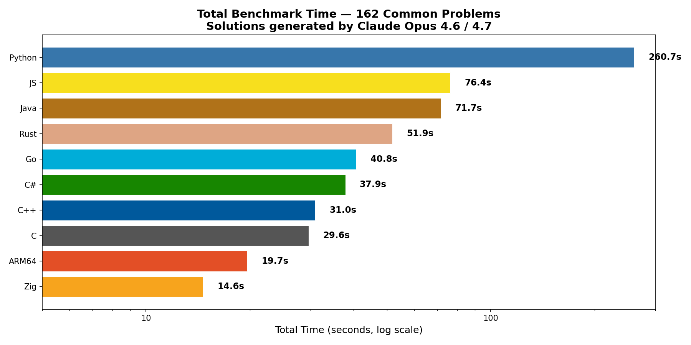

# Project Euler Cross-Language Benchmarks

**2,000+ solutions across 10 programming languages, all generated by Claude.**

200+ Project Euler problems solved in C, C++, Rust, Go, Zig, Java, C#, JavaScript, Python, and ARM64 Assembly — every solution written by [Claude](https://claude.ai) (Opus 4.6 for algorithm design, Sonnet/Haiku for language ports). Benchmarked on Apple Silicon.



## The Honest Leaderboard

The "best language" depends entirely on what you're measuring. We report **two modes** — see [THREE_MODE_REPORT.md](THREE_MODE_REPORT.md) for an additional "from-source build time" view that we keep for completeness but don't lead with (see methodology section below for why).

### Hot Mode — median of 1000 warm iterations
*"What's the cost per call if you run this in a tight loop?"* Best for hot paths in long-running services and inner loops in numerical code.

| Rank | Language | Total | vs Zig |
|------|----------|-------|--------|
| 1 | **Zig** | 8.68s | 1.00x |
| 2 | **C++** | 10.0s | 1.15x |
| 3 | **C** | 11.8s | 1.36x |
| 4 | **ARM64** | 12.1s | 1.39x |
| 5 | **C#** | 12.3s | 1.42x |
| 6 | **Go** | 13.5s | 1.56x |
| 7 | **Java** | 20.4s | 2.35x |
| 8 | **Rust** | 28.9s | 3.33x |
| 9 | **JavaScript** | 29.0s | 3.34x |
| 10 | **Python** | 88.1s | 10.15x |

### Cold Mode — first invocation, no warmup
*"How long does it take if you run the program once?"* Best for CLI tools, lambdas, scripts, and anything invoked once per task. Includes loader cost, interpreter startup (for Python), JIT warmup (for Java/C#/JS), and the first execution. **Assumes the binary already exists** for compiled languages — see methodology for why we don't include compile time.

| Rank | Language | Total | vs Zig |
|------|----------|-------|--------|
| 1 | **Zig** | 9.11s | 1.00x |
| 2 | **ARM64** | 13.1s | 1.44x |
| 3 | **C++** | 13.1s | 1.44x |
| 4 | **C** | 13.5s | 1.48x |
| 5 | **Go** | 14.9s | 1.64x |
| 6 | **C#** | 20.3s | 2.23x |
| 7 | **Rust** | 28.3s | 3.11x |
| 8 | **Java** | 38.1s | 4.18x |
| 9 | **JavaScript** | 42.2s | 4.63x |
| 10 | **Python** | **1090.9s** | **119.7x** |

*Both modes computed over 188 common problems where all 10 languages have a passing entry.*

## What the two modes reveal

- **Zig is rank 1 in both modes** — fast hot loop AND fast cold start. The `comptime` advantage is real and the small standard library means there's almost no startup cost.
- **Python is dead last in cold mode by ~10x** — Python "looks competitive" in hot mode (rank 10 at 88s) but the CPython interpreter takes ~50-200ms to launch *per invocation*. Across 188 problems that's **1090s of cold-mode time vs 9s for Zig — a 119x gap** that the old "1000-iteration only" methodology hid completely.
- **Java is rank 7 in hot, rank 8 in cold** — the JIT tax is real and visible. On problem 192, Java is 6 orders of magnitude faster after warmup than on its first call. JVM startup dominates one-shot scripts.
- **Rust drops several ranks between hot and cold on individual problems** like 074 and 067 — its per-call performance is excellent, but binary startup costs are significant. A 78μs hot-mode time vs 40ms cold start is a 500x difference for the *same code*.
- **C++ stays strong in both modes** (rank 2 hot, rank 3 cold) — fast inner loops AND fast binary startup. This is the sweet spot for "running one program multiple times" workloads.

[THREE_MODE_REPORT.md](THREE_MODE_REPORT.md) has the per-problem disagreement tables, the hot/cold quadrant analysis, and the third "from-source build" mode preserved for completeness. A legacy single-number ranking using the original `effective_time = max(warm, cold)` metric is in [RESULTS.md](RESULTS.md) for continuity with the project's earlier reports.

## Methodology — How We Try Not to Lie to Ourselves

Cross-language benchmarking is famously easy to do badly. Below are the choices we make and why. The goal is **honest, repeatable measurements** — not the most flattering numbers for any particular language.

### 1. Sequential, never parallel

Earlier versions of the runner had a `-parallel` flag that ran multiple language sweeps concurrently. **We don't use it anymore** (it's still there for emergencies, marked NOT recommended). Running 9-10 language sweeps in parallel saturates every core on the machine and produces measurements that look fast on paper but are systematically contaminated:

- **Thermal throttling**: Apple Silicon (and most modern CPUs) aggressively reduce clock speed under sustained 100% load. Problems run later in a parallel sweep clock slower than problems run earlier in the same sweep. The "median over 1000 iterations" doesn't help — the median sees the throttled clock all the way through.
- **P-core / E-core scheduling**: macOS will silently move processes onto efficiency cores under load. An E-core is ~3x slower than a P-core. A benchmark that lands on an E-core for half its iterations gets a fake-bad number.
- **Cache thrashing**: 9 simultaneous benchmarks compete for the shared L2 / system-level cache. A memory-bound problem (like a large sieve) can run 2-3x slower under contention purely as an artifact of the parallel methodology.

The default mode now runs **one language at a time, one problem at a time**, on an otherwise quiet system. It's slower in wall-clock terms (~3-5 hours for a full sweep across 10 languages × 215 problems) but the data is comparable across runs.

### 2. Cooldown between problems

Even sequential measurement isn't free of thermal effects. A long sequential run still warms the chip up over time — the first problem sees a cold CPU, the last sees a hot one. The runner now sleeps **250ms by default** (`-cooldown-ms 250`) between consecutive problems to let the CPU recover thermal headroom. This is configurable; for very fast problems where the runner overhead would dominate, you can set it lower. For very long-running benchmarks, you might set it higher.

### 3. Why we don't include compile time in the leaderboard

An earlier version of this report featured a "Total Mode" that summed compile time and cold-start time. The intent was to capture "I cloned the repo and ran it once" workflows like CI/CD pipelines. We removed it from the primary leaderboards because it was misleading about how compiled languages actually get used.

**In real life, you compile once and run many times.** A typical C++ deployment looks like: write the program, build it with `clang++ -O2 -o foo foo.cpp`, copy the binary to `/usr/local/bin/foo`, and from then on every invocation is just `foo` — pure binary load time, zero compile cost. The compile is amortized across thousands or millions of future invocations. Counting it per-invocation in a benchmark is about as fair as counting the time you spent typing the source code.

**The famous benchmarksgame project** (the canonical "language X vs language Y" comparison) explicitly excludes compile time for exactly this reason. The Computer Language Benchmarks Game measures runtime only.

**Cold mode is the honest "running once" measurement.** It captures what each language actually pays per invocation:
- **Compiled languages** (C, C++, Rust, Go, Zig, ARM64): binary load + program execution. The compile already happened, possibly months ago.
- **Interpreted languages** (Python, JavaScript): interpreter startup + module imports + parsing + bytecode compile + program execution. Python pays the parse cost on every invocation because `.pyc` caching is fragile and disabled in many deployment scenarios.
- **JIT'd languages** (Java, C#): runtime startup + class loading + tier-1 baseline JIT + program execution. The JIT only specializes "hot" code, so cold mode shows the un-specialized baseline.

This is fair because **each language pays exactly what it actually pays in production usage**. Compiled languages get charged for binary startup; interpreted languages get charged for parsing every time (because that's what really happens); JIT languages get charged for warmup. The asymmetry in *what counts as cold* is real, not a methodology artifact.

The build-from-source measurement is still computed and preserved in `THREE_MODE_REPORT.md` as a third-axis "from-source first run" view — useful for CI/CD pipeline tuning, container build optimization, or fresh-install timing — but it's no longer presented as a "running cost" measurement.

### 4. Always measure incrementally

When you add a new problem to a language repo, **run it through the bench tool immediately** rather than batching up changes for a sweep at the end:

```bash
./cmd/euler-bench/euler-bench run -lang cpp -problems 252 -no-markdown
```

This is fast (1-2 seconds per problem), it merges into the existing JSON, and crucially **it gives that single problem a quiet system to itself** — no neighbors competing for cache or scheduling. Each problem gets the best measurement conditions available at the moment it's added.

The alternative (collect changes and run a full sweep later) means every measurement is taken under whatever load conditions happened to exist during the sweep. Incremental-as-you-go means each problem's number reflects the moment that problem's solution was finalized, which is usually a quiet moment.

### 5. Two notions of "answer"

Earlier the `Answer` field was strictly typed as `json.Number`, which meant the runner crashed when a problem returned a non-numeric answer like `"199740353/29386561536000"` (problem 329's exact fraction). The field is now `interface{}` and stores numeric answers as `json.Number` (so they serialize unquoted) and string-shaped answers as plain strings. Both round-trip through the JSON and downstream tooling.

### 6. What we still don't fix

A few sources of measurement noise we acknowledge but haven't addressed:

- **Order bias across languages**: if you always run "C, C++, Rust, Go, Java, ..." in alphabetical order, C consistently sees the coldest chip and Java the warmest. The honest fix is randomized order per sweep, which we don't currently do.
- **Cache state from prior process**: even with cooldowns, the L2 cache may still hold data from the previous benchmark. A randomized inter-problem warmup would smooth this out.
- **Background processes**: macOS Spotlight, Time Machine, browser tabs, etc. all add jitter. The "right" environment is a dedicated machine in single-user mode. Most of our runs are not that.

These are all moderate effects (typically a few percent) and we choose to take the runtime hit of avoiding the major sources of error rather than chasing every last digit. The goal is **rankings that survive a re-run**, not absolute numbers down to the nanosecond.

### Why we care

This benchmark suite exists to compare AI-generated code across languages. The point is to learn whether Claude writes idiomatic-and-fast code in language X versus Y — not to crown a winner. **A methodology that biases the result undermines the entire premise.** Every choice above is one we made because the previous version produced numbers we couldn't trust.

## Key Takeaways

- **Algorithm choice matters 1000x more than language choice.** The biggest performance gaps come from algorithmic differences, not language speed.
- **Zig wins both leaderboards** — fast hot loop AND fast cold start. `comptime` evaluation precomputes work at compile time, the standard library is small enough to keep cold-start near zero, and the binary is a single statically-linked executable with no runtime dependencies.
- **C++ is the sweet spot for Claude-generated *code*** — C-speed with 35% less SLOC thanks to STL — and remains a strong contender in both modes (rank 2 hot, rank 3 cold).
- **Rust has a fat tail** — median is C-speed (1.05x) but p90 balloons to 6.44x due to borrow checker workarounds. And its binary cold start is significantly larger than C++ or Zig.
- **Java's JIT tax is real** — the same problem can be 6 orders of magnitude faster after warmup than on the first call. Hot mode rewards JIT (rank 7), cold mode punishes it (rank 8).
- **Python is the slowest in both modes**, but the *gap* differs dramatically: ~10x slower in hot mode, ~120x slower in cold mode. The interpreter startup tax (~50-200ms per invocation) is what makes one-shot Python scripts so slow at scale.
- **The "best language" question is malformed** without specifying the workload. Hot-loop code (web servers, scientific kernels) and one-shot scripts (CLI tools, lambdas) have different winners — but for *most* workloads, both modes agree on the top 3.

## The Full Story

**[JOURNEY.md](JOURNEY.md)** has the complete narrative — how this started as a curiosity about AI code quality, evolved through 11 language attempts (2 abandoned), and what we learned about LLM-generated code along the way. Includes the two-model strategy, compiler comparisons, algorithm deep-dives, and token economics.

**[THREE_MODE_REPORT.md](THREE_MODE_REPORT.md)** is the methodology-aware breakdown described above. Generated by `cmd/three-mode-report/`.

## Language Repositories

Each language has its own repo with solutions, benchmark harness, and results:

| Language | Repository | Compiler / Runtime |
|----------|------------|-------------------|
| C | [ProjectEuler.C](https://github.com/august-hill/ProjectEuler.C) | Apple Clang (LLVM) |
| C++ | [ProjectEuler.CPlusPlus](https://github.com/august-hill/ProjectEuler.CPlusPlus) | Apple Clang (LLVM) |
| Rust | [ProjectEuler.Rust](https://github.com/august-hill/ProjectEuler.Rust) | rustc (LLVM) |
| Go | [ProjectEuler.Go](https://github.com/august-hill/ProjectEuler.Go) | gc |
| Zig | [ProjectEuler.Zig](https://github.com/august-hill/ProjectEuler.Zig) | zig 0.15.x |
| Java | [ProjectEuler.Java](https://github.com/august-hill/ProjectEuler.Java) | OpenJDK HotSpot |
| C# | [ProjectEuler.CSharp](https://github.com/august-hill/ProjectEuler.CSharp) | .NET RyuJIT |
| JavaScript | [ProjectEuler.JavaScript](https://github.com/august-hill/ProjectEuler.JavaScript) | Node.js (V8) |
| Python | [ProjectEuler.Python](https://github.com/august-hill/ProjectEuler.Python) | CPython 3.11 |
| ARM64 Assembly | [ProjectEuler.ARM64](https://github.com/august-hill/ProjectEuler.ARM64) | Apple Clang (as) |

## Repo Structure

```
RESULTS.md               # Original rankings, charts, and findings (hot mode only)
THREE_MODE_REPORT.md     # Hot / cold / total breakdown with methodology notes
JOURNEY.md               # The full story behind this project
final_analysis.py        # Generates RESULTS.md and the original charts
charts/                  # Publication-quality PNG charts
data/                    # Per-language benchmark JSON files
scripts/collect.sh       # Collects results from language repos
cmd/euler-bench/         # Unified Go benchmark harness (build + run + collect)
cmd/three-mode-report/   # Re-aggregator for the three-mode analysis
```

## Running

```bash
# Run benchmarks for a specific language
./cmd/euler-bench/euler-bench run -lang go -parallel

# Run a subset of problems across all languages
./cmd/euler-bench/euler-bench run -problems 201,202,203 -parallel

# Regenerate the three-mode report from existing JSON files
./cmd/three-mode-report/three-mode-report
```

## About

All solutions were generated by [Claude Code](https://claude.ai/claude-code) on Apple Silicon (ARM64, macOS). Algorithm design and the first language implementation used Claude Opus 4.6; ports to remaining languages used Claude Sonnet/Haiku, with verification that each port produces the canonical answer. Human role was architectural guidance, problem selection, and benchmark infrastructure design.
