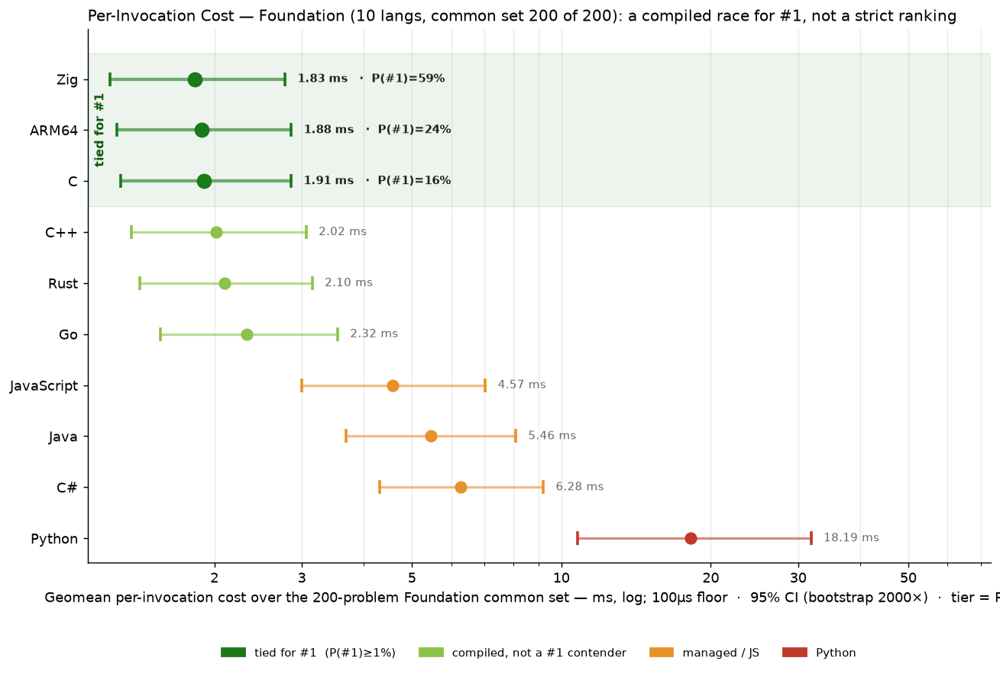

# Project Euler — Cross-Language Benchmarks

**What does it cost to solve a Project Euler problem, from a fresh process, in
ten different languages?**

This repo is the public face of a long-running experiment: every Project Euler
problem from 1 to 1011, solved by [Claude](https://claude.ai) and benchmarked on
one fixed Apple Silicon machine across **C, C++, Rust, Go, Zig, Java, C#,
JavaScript, Python and ARM64 assembly**. The solutions live in ten private
repos; this repo carries the method, the measurements (rendered, never raw) and
the story of how it was built.



## Where things stand (2026-10-03)

| Tier | Problems | Languages | Coverage |
|------|----------|-----------|----------|
| **Foundation** | 1–200 | all 10 | 200/200 in every language |
| **Deep Coverage** | 201–300 | C++, Go, Rust, Zig | 100/100 in each |
| **Frontier** | 301–1011 | C++, Go, Rust | 711/711 — every problem PE has published |

- **Every frontier problem is solved three times, independently.** Separate
  C++, Go and Rust solvers work from the problem statement alone, never seeing
  each other's code or answers; the three answers are compared only afterwards.
  Agreement is the verification — nothing is submitted to Project Euler.
- **All ~4,700 cells were re-measured on 2026-09-25/26** after a coordinated
  toolchain upgrade, so every language column is on a single, recorded
  compiler/runtime version (see the Toolchains table in
  [RESULTS.md](RESULTS.md)).
- **Headline ranking** (Foundation tier, geometric mean over the 200 shared
  problems): Zig, ARM64, C, C++, Rust and Go cluster within ~30% of each other;
  JavaScript, Java and C# follow at roughly 2.5–3.5× the leader; Python trails
  at ~10×. Full tables and per-tier rankings are in [RESULTS.md](RESULTS.md).
- **Above the Foundation tier, Rust and C++ are co-leads.** Over the ~810
  problems in 201–1011, Rust's geometric mean is 0.98× C++ and it is faster on
  51% of problems; Go runs at 1.30×. The Foundation band, being the easiest,
  understates Rust. See the JOURNEY episode
  ["Which language would we pick?"](JOURNEY.md#episode-which-language-would-we-pick-2026-10-01).

## How it works, in one paragraph

Each (language, problem) cell is compiled, then run as a **fresh OS process**
several times — more samples for cheap, noisy programs, fewer for expensive,
stable ones — and the **minimum** is reported, because timing noise on a
single machine only ever adds time. Every sample is checked against the
expected answer, and a process-contract gate rejects runs that hide work
outside the timer or quietly use more than one core. Toolchains and
third-party libraries are held fixed and upgraded together, once a quarter,
followed by a full re-bench. The normative details are in
[METHODOLOGY.md](METHODOLOGY.md).

## Read more

| Document | What's in it |
|----------|--------------|
| [RESULTS.md](RESULTS.md) | Per-tier rankings, the coverage heatmap, the toolchain table |
| [per_problem/](per_problem/) | Timing detail for every problem, one page per 100-problem band |
| [METHODOLOGY.md](METHODOLOGY.md) | The normative spec: metric, sampling rule, process-contract gate, concurrency policy, environment and toolchain policy |
| [JOURNEY.md](JOURNEY.md) | The story — the reset to a verified core, the harness rewrites, the gates that measured the weather, the independence campaign, and what LLM-driven development taught us along the way |

## Reproducibility

```bash
cd benchmarks

# Bench one language over a problem set (writes the private SQLite store)
cmd/euler-bench/euler-bench per-iter --lang rust --problems 1-200 --write

# Sequential multi-language run with streaming logs
python3 scripts/run_bench.py --problems 1-25 --langs cpp,go,rust

# Full re-bench after a toolchain upgrade: one language at a time, each over
# an explicit list of the cells it actually has
python3 scripts/rebench_all.py LISTS.json

# Regenerate RESULTS.md, per-band pages and all charts
python3 report.py
```

The Go tool ([`cmd/euler-bench/`](cmd/euler-bench/)) is the single source of
truth for measurement: one binary builds, runs, validates answers and writes
results atomically. `report.py` reads the tier model from
[`data/tiers.json`](data/tiers.json), so changing tiers is a config edit.

## Trust + safety

This repo is **public**; the language repos are **private**. Project Euler's
[publishing policy](https://projecteuler.net/about#publish) restricts solution
discussion above problem 100, so this repo carries **no raw bench data at all** —
only rendered tables, narrative and charts. Answers live solely in the
gitignored SQLite store `data/bench-private.db`, and a pre-commit hook
([`scripts/sanitization_gate.py`](scripts/sanitization_gate.py)) rejects any
staged data file outside a small config allowlist. Narrative about problems
above 100 stays at the level of process — never answers, techniques or hints.

## Repo layout

| Path | What |
|------|------|
| `README.md`, `RESULTS.md`, `METHODOLOGY.md`, `JOURNEY.md` | Overview, results, spec, story |
| `per_problem/per_problem_*.md` | Per-band timing detail (one page per 100 problems) |
| `charts/` | Rankings, speed-vs-size scatters and the coverage heatmap, per tier (PNG + SVG) |
| `cmd/euler-bench/` | The Go bench tool — the only writer of measurements |
| `report.py` | Markdown + chart generator (reads the SQLite store) |
| `scripts/run_bench.py`, `scripts/rebench_all.py` | Streaming multi-language bench orchestrators |
| `scripts/tiers.py`, `scripts/sanitization_gate.py` | Tier helper; pre-commit leak gate |
| `data/tiers.json`, `data/{parked,difficulty,levels,parallel}.json` | Config: tier model, parked problems, PE metadata, parallel-class list |
| `data/bench-private.db` | The SQLite store (gitignored) — `runs` + `run_history` |
| `archive/legacy/` | The pre-2026-05-23 site — historical reference only |

## License + contact

Project Euler problems and answers belong to Project Euler. Solutions were
generated and audited by Claude (Opus, Sonnet and Fable models) under human
direction. Methodology discussion and suggestions are welcome as GitHub issues.
