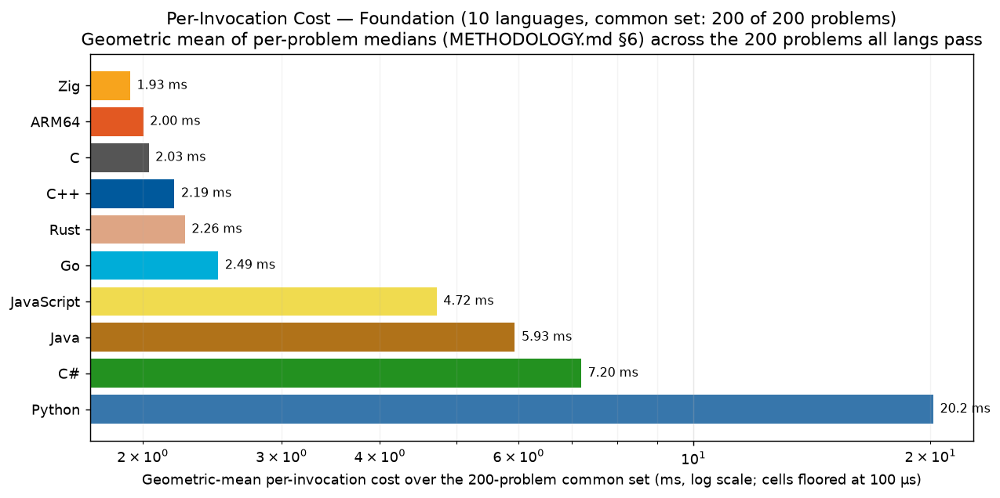
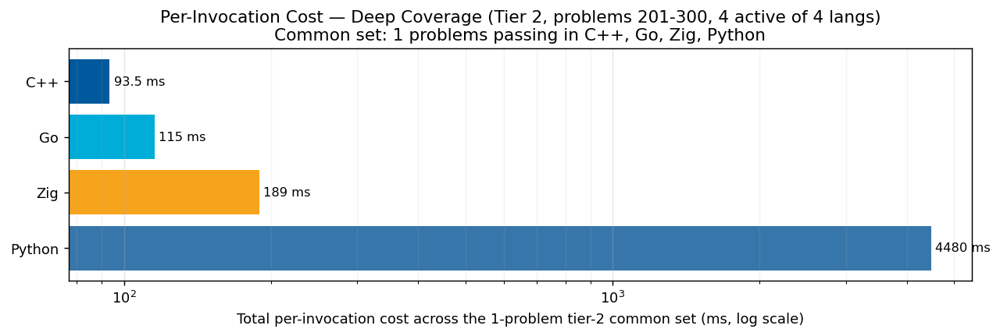
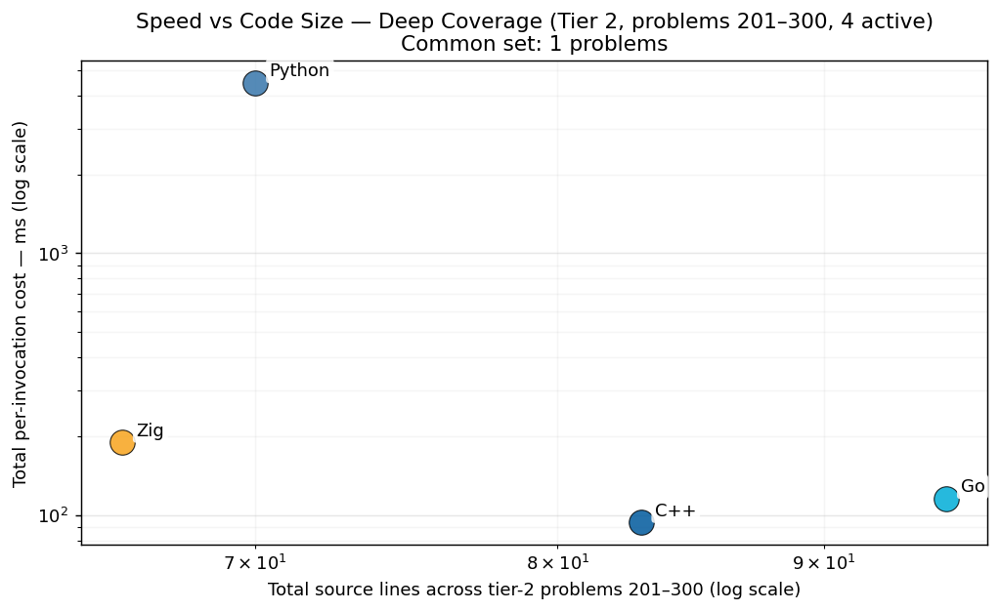
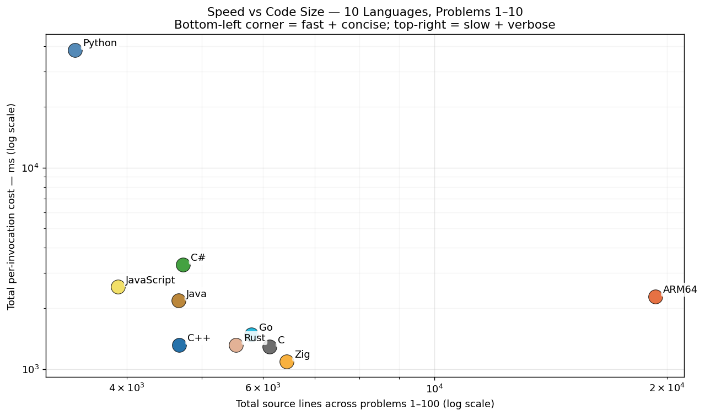
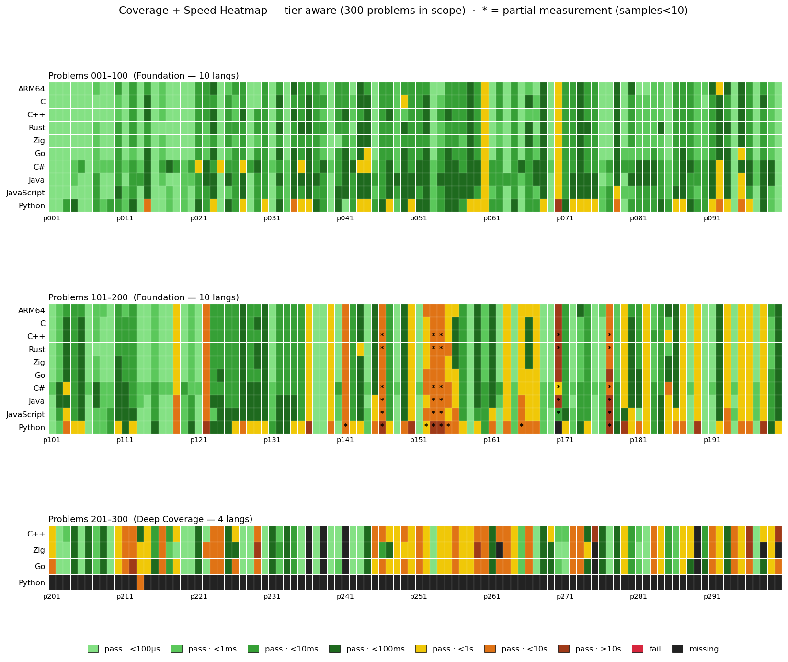

# Project Euler — Cross-Language Benchmarks

> **Scope: 2400 in-scope cells across 300 problems × tiered languages — 2283 measured (95.1% coverage).**
> The cross-language ranking below is computed over the **199-problem common set** (problems in 1-200 where every language has a passing measurement) — the apples-to-apples Foundation comparison surface.  Per-tier rankings and coverage detail appear further below.
> Growing carefully — each new problem and language is audited for state-leak
> safety, verified for answer correctness, and added only when it cleanly fits the
> measurement methodology.  See [JOURNEY.md](JOURNEY.md) for the full story of how
> we got here, including the reset from 200+ problems back to a verified 10×10
> core, then the disciplined expansion to today's 300-problem scope.

## Per-Invocation Cost — Foundation (Common Set, 199 of 200 problems)

We run each program 10 times in fresh OS processes (no warmup, no shared state).
Each invocation pays full startup + algorithm cost — the cost a real CLI / cron /
shell-loop user actually pays.  The median wall time across the 10 invocations is
the headline per-problem number, and the table sums over the 199-problem
common set so partial-coverage languages aren't artificially "faster" than fully-
covered ones.  Per-language individual coverage (which may be ≥ the common set) is
shown in the coverage block further down.



| Rank | Language | Total (199-problem common set) | Lines of code | vs Fastest |
|------|----------|--------------------:|--------------:|-----------:|
| 1 | **C** | 22.47 s | 14,346 | 1.00× |
| 2 | **C++** | 22.75 s | 10,256 | 1.01× |
| 3 | **Zig** | 25.02 s | 13,310 | 1.11× |
| 4 | **Rust** | 29.22 s | 11,443 | 1.30× |
| 5 | **Go** | 31.49 s | 13,062 | 1.40× |
| 6 | **ARM64** | 34.10 s | 39,793 | 1.52× |
| 7 | **C#** | 39.45 s | 10,825 | 1.76× |
| 8 | **Java** | 43.42 s | 10,468 | 1.93× |
| 9 | **JavaScript** | 68.46 s | 9,123 | 3.05× |
| 10 | **Python** | 669.59 s | 8,459 | 29.80× |

## Per-Invocation Cost — Deep Coverage (Tier 2, problems 201-300, 4 languages)

Same per-invocation metric, restricted to the deeper subset of languages (C++, Go, Zig, Python) that intentionally pushed past problem 200. The other 6 Foundation languages are out of tier scope here — they're capped at 200 by the project's language-cap policy (see JOURNEY.md).



| Rank | Language | Total (1-problem common set) | Lines of code | vs Fastest |
|------|----------|--------------------:|--------------:|-----------:|
| 1 | **C++** | 93.46 ms | 83 | 1.00× |
| 2 | **Go** | 115.33 ms | 95 | 1.23× |
| 3 | **Zig** | 189.24 ms | 66 | 2.02× |
| 4 | **Python** | 4.48 s | 70 | 47.94× |

### Speed vs Code Size — Tier 2

Same scatter as the Foundation chart, restricted to the tier-2 active languages over problems 201–300.



## Speed vs Code Size

How much code does each language need to solve these 200 Foundation problems, and how
fast does that code run?  Bottom-left = fast and concise; top-right = slow
and verbose.  ARM64's outlier position (most lines) is expected — assembly
trades verbosity for direct hardware control.



## Coverage + Speed Heatmap

One cell per (language, problem).  Color shows whether the cell passes the
invocation-isolation + answer-correctness audit and how fast it runs:

- 🟢 **Green** — pass <100 ms; 4 levels (lighter = faster)
- 🟡 **Amber** — pass 100 ms – 1 s (noticeably slow)
- 🟠 **Orange** — pass 1 s – 10 s (feels broken interactive)
- 🟤 **Burnt orange** — pass ≥ 10 s (serious algorithm — multi-second computation)
- 🔴 **Red** — fail (wrong answer, build error, timeout)
- ⚫ **Black** — missing entry (no measurement)
- **`*`** — *partial measurement* (samples<10, suite-standard is 10); the cell median is still meaningful for >1s problems but the variance estimate is degraded



**🔍 [Open the SVG version](https://raw.githubusercontent.com/august-hill/ProjectEuler.Benchmarks/main/charts/per_iter_coverage_grid.svg)** — same chart, with a
hover tooltip on every cell (`p347 Zig: 2.3 ms`).  The link goes direct to
`raw.githubusercontent.com` because GitHub's `/blob/` viewer no longer renders
inline SVG previews; tooltips also don't fire inside the inline ``
image above because browsers treat `` SVGs as opaque.

Rows are in fixed tier order (native → managed → interpreted) so the chart
doesn't reshuffle between snapshots as ranking-by-total drifts.  Problems are
chunked into bands of 100 (currently 3 bands), which keeps cells legibly sized as we extend
toward the 1000-problem target.  Native compiled rows (ARM64 / C / C++ / Rust /
Zig) sit near the top in mostly bright-green territory; managed-runtime rows
(C# / Java / JavaScript) carry darker greens and scattered amber from JIT
startup; Python at the bottom shows the heaviest amber load.  Vertical amber
bars that cut across multiple languages (currently visible near p061 and p071)
flag *intrinsically hard* problems — the algorithm cost dominates regardless of
language.  No red or black cells: the audit gate is holding.

## Per-Problem Detail

Median wall time per fresh-process invocation, for each (language, problem).
Split across 3 pages, one per 100-problem band, so this main page stays navigable.  Each band's table is tier-filtered (10 langs in Foundation bands, 4 in Deep Coverage).

| Band | Tier | Languages | Page |
|------|------|-----------|------|
| p001–p100 | Foundation | 10 | [Open](per_problem/per_problem_001-100.md) |
| p101–p200 | Foundation | 10 | [Open](per_problem/per_problem_101-200.md) |
| p201–p300 | Deep Coverage | 4 | [Open](per_problem/per_problem_201-300.md) |

## Method

For each (language, problem):

1. Build the binary (or `as` + `cc` for ARM64, `dotnet build` for C#, etc.).
2. Run the binary 10 times, each in a fresh OS process.  No warmup; no shared state.
3. Each invocation prints `RESULT|time_ns=N|answer=A` — one line per process,
   captured by the bench tool.  The answer is compared against the canonical
   (each source file's `// Answer:` header comment); the bench aborts on mismatch.
4. We report the **median** wall time across the 10 invocations.

That's the entire metric.  No "hot" vs "cold" — just per-invocation cost, which
is what every CLI / cron / shell-loop user actually pays.

### How each language is built

Every compiled language uses release / optimized builds — no debug-mode
measurements:

| Language | Build command | Optimization |
|----------|---------------|--------------|
| C | `gcc -O2 -std=c11 -I.. main.c -o main_bench -lm` | `-O2` |
| C++ | `g++ -O2 -std=c++17 -I../include main.cpp -o main_bench -lm` | `-O2` |
| ARM64 | `as ... && cc -O2 -o main_bench main.c solve.o -lm` | `-O2` on the C harness; the `.s` file is hand-tuned |
| Rust | `cargo build --release` | `opt-level=3 + lto=true` (per repo's `[profile.release]`) |
| Go | `go build -o main_bench main.go` | default (Go optimizes by default; no `-N` debug flag) |
| Zig | `zig build-exe -O ReleaseFast ...` | `ReleaseFast` |
| C# | `dotnet build -c Release` | `Release` |
| Java | `javac Main.java` | none at compile; JVM JIT optimizes at runtime |
| JavaScript | (no build) | V8 JIT optimizes at runtime |
| Python | (no build) | none — interpreter |

Note: Java/JS/C# show a runtime startup penalty in the per-invocation cost
because their JIT/runtime warm-up happens *every* fresh process.  This is
the honest cost of the language model under a CLI-invocation workload.

### Note on Zig timings (comptime-fold bias)

> Of the 300 problems benchmarked, **roughly 20-25% of cells** are fully
> constant-foldable under Zig's `-O ReleaseFast` flag: the inputs are compile-time
> literals and the arithmetic is pure, so the optimizer reduces `solve()` to a
> constant return.  Known fold-candidates include p001, p002, p005, p006, p009,
> p013, p017, p018, p019, p024, p028, p031, p033, p040, p045, p063, p069, p094,
> p097, p100.  Those cells in the Zig column measure "the cost of returning an
> immediate," not algorithm execution.  The remaining ~75% do nontrivial runtime
> work and are honest timings.
>
> This is a systematic methodological bias that pulls Zig's aggregate ranking
> downward relative to languages whose optimizers don't fold as aggressively at
> these problem sizes.  Other compiled langs (C, C++ at `-O2`, Rust at `-O3`, Go,
> ARM64) also fold trivial closed-form cases; Zig is just particularly aggressive
> about it.  We flag it here for transparency rather than as a knock on Zig — the
> timings are real measurements of what `-O ReleaseFast` produces.

### Language idioms: stdlib vs ecosystem packages

Every language has a package ecosystem (Boost / vcpkg for C++, cargo / crates.io
for Rust, NuGet for C#, pip for Python, etc.), and *what a native developer would
write* almost always includes the well-known libraries for that ecosystem.
Forcing every language to stdlib-only would penalize languages whose ecosystems
are central to how they're actually used in practice.

Where a single library dominates the ecosystem for the problem domain, we use it:

| Language | Ecosystem package used | Rationale |
|----------|------------------------|-----------|
| **C++** | `primesieve` (Kim Walisch) | Best-in-class C++ prime library; commonly linked alongside Boost/abseil in C++ projects doing prime work. |
| **C** | `libprimesieve` (C bindings) | Same library, exposed via C API — `#include <primesieve.h>`, link `-lprimesieve`. |
| **Rust** | `primal` (Huon Wilson) | The dominant prime crate on crates.io; what a Rust dev doing prime work reaches for. |
| **Python** | `numpy` | The standard numerical-Python library; `primes[i*i::i] = False` slice assignment IS the Pythonic sieve. |
| **Go** | stdlib only | Go culture is stdlib-first; no single prime package dominates the ecosystem. |
| **Zig** | stdlib only | Zig's package ecosystem is young; stdlib-only is current idiom. |
| **Java** | stdlib only | Apache Commons Math has primes, but Java culture is split between stdlib-only and Commons; we keep it stdlib for now. |
| **C#** | stdlib only | `Open.Numeric.Primes` exists but isn't dominant; most C# devs roll their own sieve at this scale. |
| **JavaScript** | stdlib (Node) only | `Uint8Array` typed-array sieve IS the perf-aware JS idiom; no npm package is dominant. |
| **ARM64** | libc (`malloc`/`free`) | The "ecosystem" for asm IS the platform's libc; that's what we use. |

**Implication for the chart**: C++'s ~340 µs total reflects both "C++ language
speed" and "primesieve is a well-optimized library."  If we measured
hand-rolled C++ against hand-rolled Rust/Go/Zig, the gap would shrink.  We
report C++ at its ecosystem-aware best, because *that's how C++ devs actually
write C++*.  Same principle applies symmetrically to every other lang.

### What's intentionally not measured

- **In-process warm iterations.**  Server / daemon scenarios are a different
  question — they'd reward language-internal caches (Rust `OnceLock`, primesieve
  internal state, `@lru_cache`, etc.) in ways that don't match the per-invocation
  reality.  See [JOURNEY.md](JOURNEY.md) for the full reasoning behind dropping the
  warm-iter metric.
- **Compile time as a separate column.**  Build cost is part of the user's
  experience for compiled languages, but in our "shell-loop" model the binary is
  already built once.  Build time is observed and recorded for diagnostic use but
  not part of the headline.

### Why the OS process boundary IS the audit tool

Every language has *some* way to cache state for re-use within one process: Rust's
`OnceLock`, C++ libraries' internal lazy-init, Python's `@lru_cache`, Java's static
`final` precomputed tables.  These are *idiomatic, valuable patterns in their
languages*.  We don't want to rule them out — we want each language to look like a
native would write it.

The process boundary makes that work fairly: when each invocation is a fresh OS
process, *every* in-process cache starts empty.  No language gets an unfair
amortization advantage.  No source-code refactoring is required to maintain cross-
language honesty — the OS enforces it for free.

## Sub-Millisecond Floor

On Apple Silicon, process spawn (`fork` + `exec`) costs ~5–10 ms.  Problems where
the algorithm takes < 1 ms (currently p001–p006 in most languages) are effectively
measuring spawn cost, not algorithmic merit.  That **is** what a CLI user pays, so
the number is still meaningful — but the cross-language signal on these problems
mostly reflects runtime startup cost.  The interesting algorithmic signal starts
around p007+.

## Reproducibility

```bash
cd pe/benchmarks
cmd/euler-bench/euler-bench per-iter --lang all --problems 1-300 --iters 10 --write
python3 report.py
```

Sanitization invariant: the public repo carries no raw bench data files —
only this rendered narrative and the charts.  All measurements live in the
gitignored SQLite SSOT `data/bench-private.db`.  See `scripts/sanitization_gate.py`.

## Methodology Story

See [JOURNEY.md](JOURNEY.md) for the full story.  Recent chapters cover:
- The 24-hour cache-strip campaign and its reset (155 source edits reverted)
- The shift from in-process warm iterations to fresh-process per-invocation cost
- The invocation-isolation principle and why the OS is the audit tool
- The data-architecture refactor (single Go writer, no `flock`, no hook chain)

