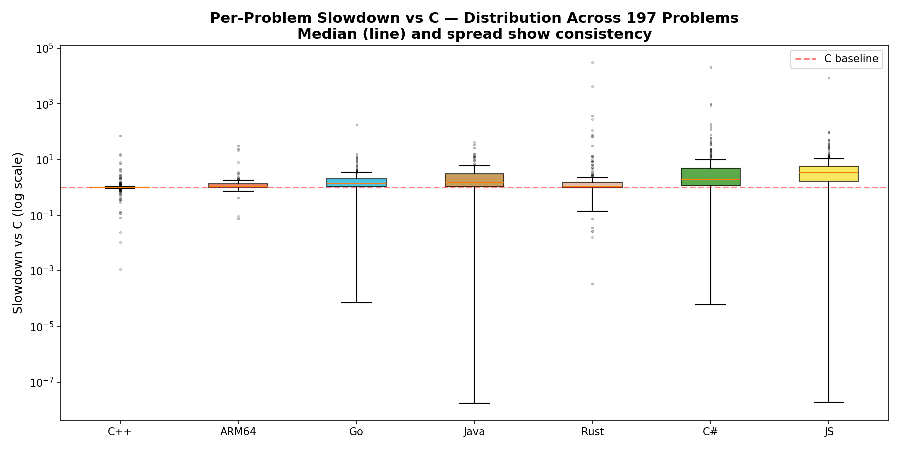
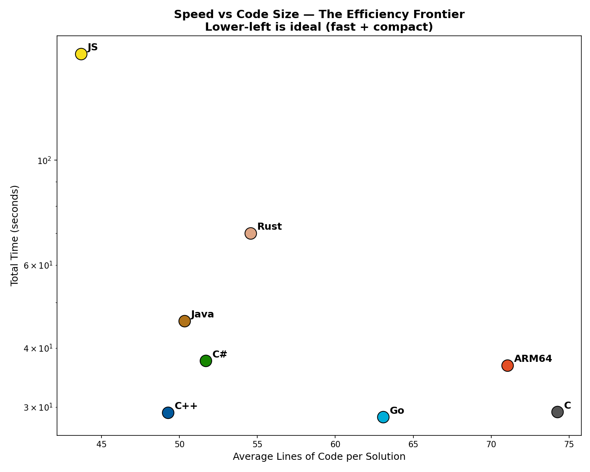
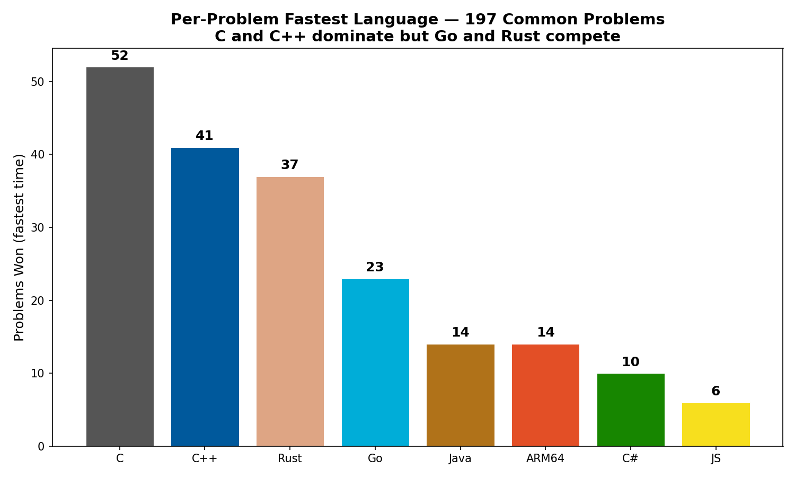
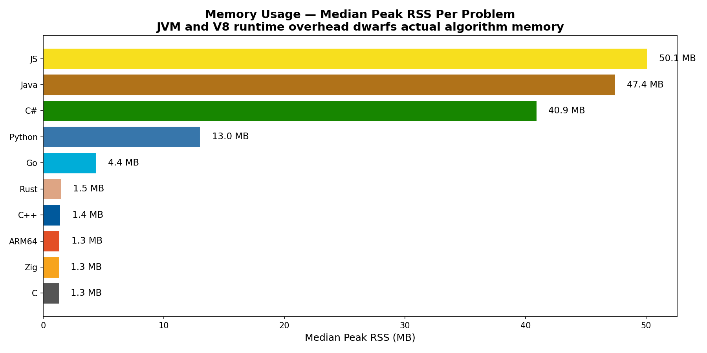
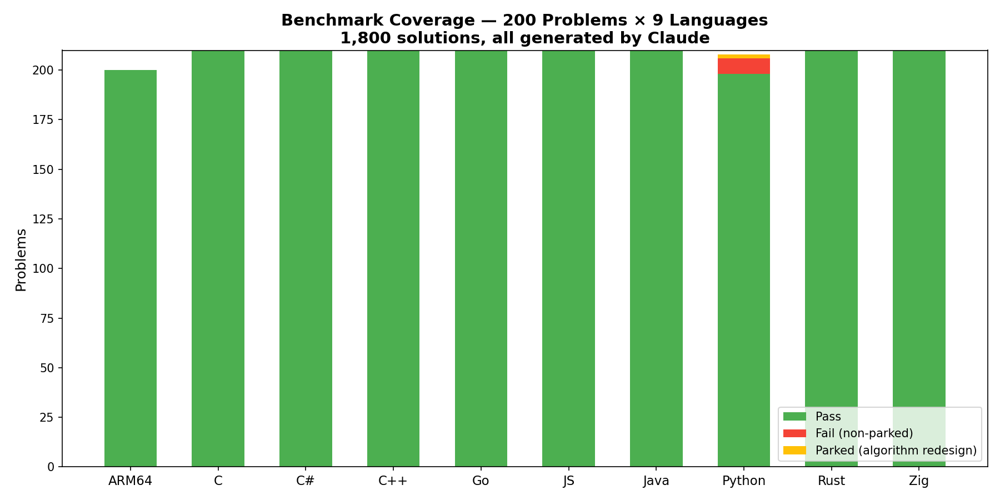

# Project Euler Cross-Language Benchmarks — Final Results

> **1,800 solutions across 9 languages, all generated by Claude Opus 4.6 and Sonnet 4.6.**
> **Apple Silicon (ARM64) · macOS · March 2026**

## The Rankings

| Rank | Language | Total Time | vs C | Avg SLOC | Wins |
|------|----------|-----------|------|----------|------|
| 1 | **Go** | 28.58s | 0.97x | 63 | 23 |
| 2 | **C++** | 29.23s | 1.00x | 49 | 41 |
| 3 | **C** | 29.33s | 1.00x | 74 | 52 |
| 4 | **ARM64** | 36.79s | 1.25x | 71 | 14 |
| 5 | **C#** | 37.61s | 1.28x | 52 | 10 |
| 6 | **Java** | 45.71s | 1.56x | 50 | 14 |
| 7 | **Rust** | 70.09s | 2.39x | 55 | 37 |
| 8 | **Python** | 103.13s | 3.52x | 39 | 0 |
| 9 | **JS** | 168.05s | 5.73x | 44 | 6 |

*197 common problems, excluding 3 parked (algorithm redesign needed)*

## Charts

### Total Benchmark Time

### Slowdown Distribution vs C

### Speed vs Code Size

### Per-Problem Wins

### Memory Usage

### Benchmark Coverage

## Key Findings

1. **C++ is the best language for Claude-generated computational code** — tied with C for speed but 35% more compact. STL gives Claude better building blocks.

2. **Go is the most consistent** — only 1.3x slower than C++ with zero outlier problems. Best balance of speed, reliability, and readability.

3. **Rust has a fat tail** — median 1.05x (essentially C-speed) but p90 is 6.44x. Claude occasionally generates suboptimal Rust due to borrow checker workarounds.

4. **Algorithm choice matters 1000x more than language choice.** The biggest per-problem spreads are algorithm divergence, not language speed. Problem 173's sqrt fix was a 23,000x improvement.

5. **Python is ~40x slower for computation** but its compact syntax (42 avg SLOC vs 72 for C) makes it ideal for prototyping. 5 problems simply can't finish within timeout.

6. **Java's JVM uses 10-40x more memory** than native languages for the same algorithms. The garbage collector's overhead is real but only matters for memory-constrained environments.

## Project Stats

- **Languages:** C, C++, Rust, Go, Java, C#, JavaScript, Python, ARM64 Assembly
- **Problems:** 200 (Project Euler #1-200)
- **Total solutions:** 1794
- **Pass rate:** 1769/1794 (98.6%)
- **Parked (algorithm redesign):** 3 problems across all languages
- **Generated by:** Claude Opus 4.6 (design + algorithms) and Sonnet 4.6 (language ports)
- **Platform:** Apple Silicon, macOS, ARM64

## Read the Full Story

See [JOURNEY.md](JOURNEY.md) for the complete narrative — from origin story through algorithm hunts, language analysis, and lessons learned.
