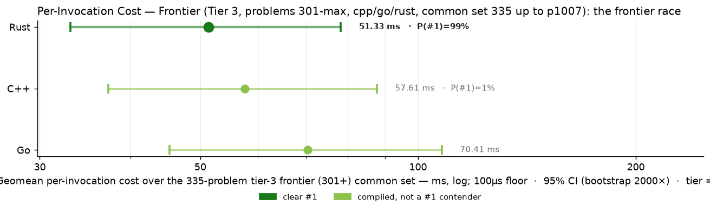
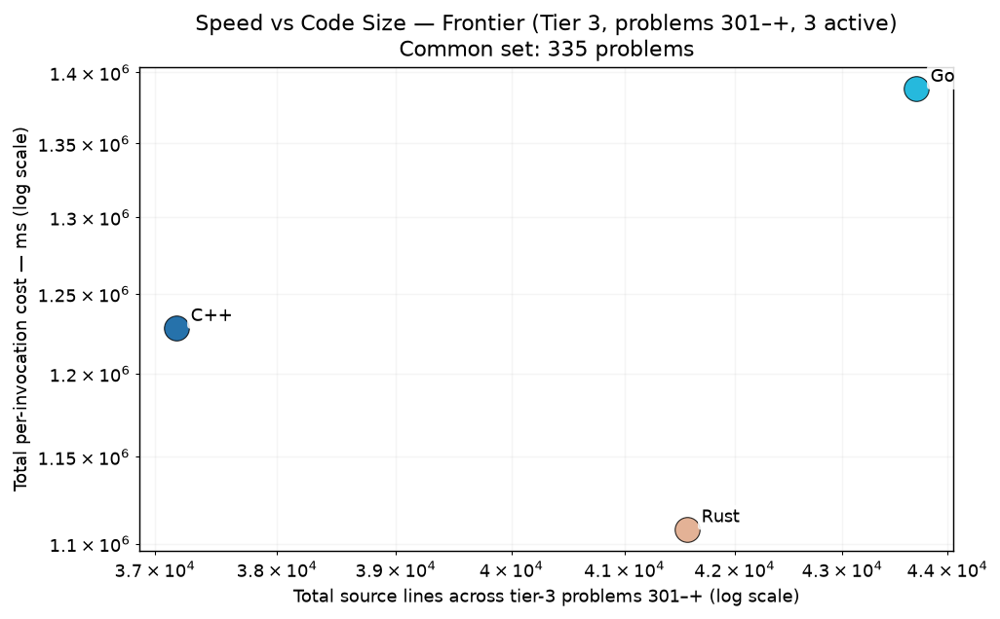

# Project Euler — Cross-Language Benchmarks

> **Scope: 4621 in-scope cells across 1007 problems × tiered languages — 3621 measured (78.4% coverage).**
> The cross-language ranking below is computed over the **200-problem common set** (problems in 1-200 where every language has a passing measurement) — the apples-to-apples Foundation comparison surface.  Per-tier rankings and coverage detail appear further below.
> Growing carefully — each new problem and language is audited for state-leak
> safety, verified for answer correctness, and added only when it cleanly fits the
> measurement methodology.  See [JOURNEY.md](JOURNEY.md) for the full story of how
> we got here, including the reset from 200+ problems back to a verified 10×10
> core, then the disciplined expansion to today's 1007-problem scope.

## Foundation — Tier 1 (10 languages, problems 1-200)

All 10 languages benchmarked across the first 200 problems — the apples-to-apples comparison surface that anchors the suite's headline rankings.

### Per-Invocation Cost (Common Set, 200 of 200 problems)

Each program runs in fresh OS processes (no warmup, no shared state) under the
2-or-3 corroborated sampling rule; every invocation pays full startup + algorithm
cost — the cost a real CLI / cron / shell-loop user actually pays.  The ranking
below is the **geometric mean** of per-problem medians over the 200-problem
common set, with cells floored at 100 µs so timer-granularity trivia can't swing
the mean; the sum over the same set is shown as a secondary column.  See
[METHODOLOGY.md](METHODOLOGY.md) §3 (sampling) and §6 (ranking) for why.


> **The top compiled languages are a statistical tie for #1, not a strict order.** Bootstrapping the geomean over the common set (2000× resamples) leaves several compiled langs with overlapping 95% confidence intervals and non-trivial P(#1) (the chance a lang is fastest across resamples) — the chart above shows the intervals. Read the table below as **tiers**, not a 1-N ranking: the fine order among the top compiled langs is within measurement noise. The coarse structure (compiled → managed → Python) is robust.

| Rank | Language | Geomean (200-problem common set) | Total (sum) | Lines of code | vs Fastest |
|------|----------|--------------------:|------------:|--------------:|-----------:|
| 1 | **Zig** | 2.18 ms | 25.60 s | 13,474 | 1.00× |
| 2 | **ARM64** | 2.24 ms | 34.64 s | 40,297 | 1.03× |
| 3 | **C** | 2.26 ms | 22.60 s | 14,524 | 1.04× |
| 4 | **C++** | 2.34 ms | 22.88 s | 10,369 | 1.08× |
| 5 | **Rust** | 2.47 ms | 28.45 s | 11,614 | 1.13× |
| 6 | **Go** | 2.79 ms | 32.38 s | 13,225 | 1.28× |
| 7 | **JavaScript** | 4.78 ms | 70.11 s | 9,310 | 2.20× |
| 8 | **Java** | 6.03 ms | 45.23 s | 10,611 | 2.77× |
| 9 | **C#** | 7.42 ms | 40.26 s | 11,019 | 3.41× |
| 10 | **Python** | 20.00 ms | 672.13 s | 8,558 | 9.19× |

### Speed vs Code Size

How much code does each language need to solve these 200 Foundation problems, and how fast does that code run?  Bottom-left = fast and concise; top-right = slow and verbose.  ARM64's outlier position (most lines) is expected — assembly trades verbosity for direct hardware control.


## Deep Coverage — Tier 2 (5 languages, problems 201-300)

Same per-invocation metric, restricted to the deeper subset of languages (C++, Go, Python, Rust, Zig) that intentionally pushed past problem 200. The other 5 Foundation languages are out of tier scope here — they're capped at 200 by the project's language-cap policy (see JOURNEY.md).

### Per-Invocation Cost (Common Set, 92 of 100 problems)


| Rank | Language | Geomean (92-problem common set) | Total (sum) | Lines of code | vs Fastest |
|------|----------|--------------------:|------------:|--------------:|-----------:|
| 1 | **Zig** | 19.19 ms | 85.66 s | 10,847 | 1.00× |
| 2 | **Rust** | 21.58 ms | 65.37 s | 9,501 | 1.12× |
| 3 | **C++** | 23.26 ms | 70.91 s | 12,103 | 1.21× |
| 4 | **Go** | 24.96 ms | 82.45 s | 9,894 | 1.30× |
| 5 | **Python** | 181.90 ms | 612.44 s | 6,767 | 9.48× |

### Speed vs Code Size

Same scatter as the Foundation chart, restricted to the tier-2 active languages over problems 201–300.


## Frontier — Tier 3 (3 languages, problems 301+)

The frontier verification trio — C++, Go, Rust — on problems above 300. 3-way cross-language agreement is the verification protocol (strictly stronger than 2-way; see JOURNEY.md "Tier Reframing" episode for the p254 lesson that motivated it). Python and Zig are explicitly out of this tier — python's wall cost makes it impractical at level 5+, and zig's role caps at Tier 2.

### Per-Invocation Cost (Common Set, 335 of ≤707 problems in scope)



| Rank | Language | Geomean (335-problem common set) | Total (sum) | Lines of code | vs Fastest |
|------|----------|--------------------:|------------:|--------------:|-----------:|
| 1 | **Rust** | 51.33 ms | 1108.17 s | 41,568 | 1.00× |
| 2 | **C++** | 57.61 ms | 1228.32 s | 37,176 | 1.12× |
| 3 | **Go** | 70.41 ms | 1388.35 s | 43,703 | 1.37× |

### Speed vs Code Size

Same scatter as the Foundation chart, restricted to the tier-3 active languages over problems 301–+.



## Coverage Heatmap

One cell per (language, problem).  Color shows whether the cell passes the
invocation-isolation + answer-correctness audit and how fast it runs:

- 🟢 **Green** — pass <100 ms; 4 levels (lighter = faster)
- 🟡 **Amber** — pass 100 ms – 1 s (noticeably slow)
- 🟠 **Orange** — pass 1 s – 10 s (feels broken interactive)
- 🟤 **Burnt orange** — pass ≥ 10 s (serious algorithm — multi-second computation)
- 🔴 **Red** — fail (wrong answer, build error, timeout)
- ⚫ **Black** — missing entry (no measurement)
- **`*`** — *partial measurement* (single sample; suite standard is 2-or-3 corroborated samples per METHODOLOGY.md §3)


Rows are in fixed tier order (native → managed → interpreted) so the chart
doesn't reshuffle between snapshots as ranking-by-total drifts.  Problems are
chunked into bands of 100 (currently 11 bands), which keeps cells legibly sized as we extend
toward the 1000-problem target.  Native compiled rows (ARM64 / C / C++ / Rust /
Zig) sit near the top in mostly bright-green territory; managed-runtime rows
(C# / Java / JavaScript) carry darker greens and scattered amber from JIT
startup; Python at the bottom shows the heaviest amber load.  Vertical amber
bars that cut across multiple languages (currently visible near p061 and p071)
flag *intrinsically hard* problems — the algorithm cost dominates regardless of
language.  Red cells are process-contract failures (METHODOLOGY.md §2) — the
per-problem detail pages carry each failure's reason class.

## Per-Problem Detail

Median wall time per fresh-process invocation, for each (language, problem).
Split across 11 pages, one per 100-problem band, so this main page stays navigable.  Each band's table is tier-filtered (10 langs in Foundation bands, 5 in Deep Coverage).

| Band | Tier | Languages | Page |
|------|------|-----------|------|
| p0001–p0100 | Foundation | 10 | [Open](per_problem/per_problem_0001-0100.md) |
| p0101–p0200 | Foundation | 10 | [Open](per_problem/per_problem_0101-0200.md) |
| p0201–p0300 | Deep Coverage | 5 | [Open](per_problem/per_problem_0201-0300.md) |
| p0301–p0400 | Frontier | 3 | [Open](per_problem/per_problem_0301-0400.md) |
| p0401–p0500 | Frontier | 3 | [Open](per_problem/per_problem_0401-0500.md) |
| p0501–p0600 | Frontier | 3 | [Open](per_problem/per_problem_0501-0600.md) |
| p0601–p0700 | Frontier | 3 | [Open](per_problem/per_problem_0601-0700.md) |
| p0701–p0800 | Frontier | 3 | [Open](per_problem/per_problem_0701-0800.md) |
| p0801–p0900 | Frontier | 3 | [Open](per_problem/per_problem_0801-0900.md) |
| p0901–p1000 | Frontier | 3 | [Open](per_problem/per_problem_0901-1000.md) |
| p1001–p1007 | Frontier | 3 | [Open](per_problem/per_problem_1001-1007.md) |

## Method

For each (language, problem):

1. Build the binary (or `as` + `cc` for ARM64, `dotnet build` for C#, etc.).
2. Run fresh-process samples under the **2-or-3 corroboration rule** ([METHODOLOGY.md](METHODOLOGY.md) §3): two samples that agree within 5% settle the cell; otherwise a third tie-breaks by median.  No warmup; no shared state.
3. Each invocation prints `RESULT|time_ns=N|answer=A` — one line per process,
   captured by the bench tool.  The answer is compared against the canonical
   (each source file's `// Answer:` header comment); the bench aborts on mismatch.
4. Alongside the internal time, the harness records **process observables** — 
   subprocess wall time, CPU time, load average — and enforces the process
   contract at write time (METHODOLOGY.md §2): rows with untimed work or
   serial-class parallelism are recorded as failures, never as fast times.

That's the entire metric.  No "hot" vs "cold" — just per-invocation cost, which
is what every CLI / cron / shell-loop user actually pays.

### Sub-millisecond floor

On Apple Silicon, process spawn (`fork` + `exec`) costs ~5–10 ms.  Problems where
the algorithm takes < 1 ms (currently p001–p006 in most languages) are effectively
measuring spawn cost, not algorithmic merit.  That **is** what a CLI user pays, so
the number is still meaningful — but the cross-language signal on these problems
mostly reflects runtime startup cost.  The interesting algorithmic signal starts
around p007+.

### How each language is built

Every compiled language uses release / optimized builds — no debug-mode
measurements:

| Language | Build command | Optimization |
|----------|---------------|--------------|
| C | `gcc -O2 -std=c11 -I.. main.c -o main_bench -lm` | `-O2` |
| C++ | `g++ -O2 -std=c++17 -I../include main.cpp -o main_bench -lm` | `-O2` |
| ARM64 | `as ... && cc -O2 -o main_bench main.c solve.o -lm` | `-O2` on the C harness; the `.s` file is hand-tuned |
| Rust | `cargo build --profile release-lto` | fat LTO + `codegen-units=1` (per repo's `[profile.release-lto]`) |
| Go | `go build -o main_bench main.go` | default (Go optimizes by default; no `-N` debug flag) |
| Zig | `zig build-exe -O ReleaseFast ...` | `ReleaseFast` |
| C# | `dotnet build -c Release` | `Release` |
| Java | `javac Main.java` | none at compile; JVM JIT optimizes at runtime |
| JavaScript | (no build) | V8 JIT optimizes at runtime |
| Python | (no build) | none — interpreter |

Note: Java/JS/C# show a runtime startup penalty in the per-invocation cost
because their JIT/runtime warm-up happens *every* fresh process.  This is
the honest cost of the language model under a CLI-invocation workload.

### Note on Zig timings (comptime-fold bias)

> Of the 1007 problems benchmarked, **roughly 20-25% of cells** are fully
> constant-foldable under Zig's `-O ReleaseFast` flag: the inputs are compile-time
> literals and the arithmetic is pure, so the optimizer reduces `solve()` to a
> constant return.  Known fold-candidates include p001, p002, p005, p006, p009,
> p013, p017, p018, p019, p024, p028, p031, p033, p040, p045, p063, p069, p094,
> p097, p100.  Those cells in the Zig column measure "the cost of returning an
> immediate," not algorithm execution.  The remaining ~75% do nontrivial runtime
> work and are honest timings.
>
> This is a systematic methodological bias that pulls Zig's aggregate ranking
> downward relative to languages whose optimizers don't fold as aggressively at
> these problem sizes.  Other compiled langs (C, C++ at `-O2`, Rust at `-O3`, Go,
> ARM64) also fold trivial closed-form cases; Zig is just particularly aggressive
> about it.  We flag it here for transparency rather than as a knock on Zig — the
> timings are real measurements of what `-O ReleaseFast` produces.

### Language idioms: stdlib vs ecosystem packages

Every language has a package ecosystem (Boost / vcpkg for C++, cargo / crates.io
for Rust, NuGet for C#, pip for Python, etc.), and *what a native developer would
write* almost always includes the well-known libraries for that ecosystem.
Forcing every language to stdlib-only would penalize languages whose ecosystems
are central to how they're actually used in practice.

Where a single library dominates the ecosystem for the problem domain, we use it:

| Language | Ecosystem package used | Rationale |
|----------|------------------------|-----------|
| **C++** | `primesieve` (Kim Walisch) | Best-in-class C++ prime library; commonly linked alongside Boost/abseil in C++ projects doing prime work. |
| **C** | `libprimesieve` (C bindings) | Same library, exposed via C API — `#include <primesieve.h>`, link `-lprimesieve`. |
| **Rust** | `primal` (Huon Wilson) | The dominant prime crate on crates.io; what a Rust dev doing prime work reaches for. |
| **Python** | `numpy` | The standard numerical-Python library; `primes[i*i::i] = False` slice assignment IS the Pythonic sieve. |
| **Go** | stdlib only | Go culture is stdlib-first; no single prime package dominates the ecosystem. |
| **Zig** | stdlib only | Zig's package ecosystem is young; stdlib-only is current idiom. |
| **Java** | stdlib only | Apache Commons Math has primes, but Java culture is split between stdlib-only and Commons; we keep it stdlib for now. |
| **C#** | stdlib only | `Open.Numeric.Primes` exists but isn't dominant; most C# devs roll their own sieve at this scale. |
| **JavaScript** | stdlib (Node) only | `Uint8Array` typed-array sieve IS the perf-aware JS idiom; no npm package is dominant. |
| **ARM64** | libc (`malloc`/`free`) | The "ecosystem" for asm IS the platform's libc; that's what we use. |

**Implication for the chart**: C++'s ~340 µs total reflects both "C++ language
speed" and "primesieve is a well-optimized library."  If we measured
hand-rolled C++ against hand-rolled Rust/Go/Zig, the gap would shrink.  We
report C++ at its ecosystem-aware best, because *that's how C++ devs actually
write C++*.  Same principle applies symmetrically to every other lang.

### What's intentionally not measured

- **In-process warm iterations.**  Server / daemon scenarios are a different
  question — they'd reward language-internal caches (Rust `OnceLock`, primesieve
  internal state, `@lru_cache`, etc.) in ways that don't match the per-invocation
  reality.  See [JOURNEY.md](JOURNEY.md) for the full reasoning behind dropping the
  warm-iter metric.
- **Compile time as a separate column.**  Build cost is part of the user's
  experience for compiled languages, but in our "shell-loop" model the binary is
  already built once.  Build time is observed and recorded for diagnostic use but
  not part of the headline.

### Why the OS process boundary IS the audit tool

Every language has *some* way to cache state for re-use within one process: Rust's
`OnceLock`, C++ libraries' internal lazy-init, Python's `@lru_cache`, Java's static
`final` precomputed tables.  These are *idiomatic, valuable patterns in their
languages*.  We don't want to rule them out — we want each language to look like a
native would write it.

The process boundary makes that work fairly: when each invocation is a fresh OS
process, *every* in-process cache starts empty.  No language gets an unfair
amortization advantage.  No source-code refactoring is required to maintain cross-
language honesty — the OS enforces it for free.

## Reproducibility

```bash
cd pe/benchmarks
cmd/euler-bench/euler-bench per-iter --lang all --problems 1-1007 --write
python3 report.py
```

Sanitization invariant: the public repo carries no raw bench data files —
only this rendered narrative and the charts.  All measurements live in the
gitignored SQLite SSOT `data/bench-private.db`.  See `scripts/sanitization_gate.py`.

## Methodology

The normative spec — metric, sampling, process-contract enforcement,
serial/parallel-class concurrency policy, and ranking rationale — is
[METHODOLOGY.md](METHODOLOGY.md).  See [JOURNEY.md](JOURNEY.md) for the story.  Recent chapters cover:
- The 24-hour cache-strip campaign and its reset (155 source edits reverted)
- The shift from in-process warm iterations to fresh-process per-invocation cost
- The invocation-isolation principle and why the OS is the audit tool
- The data-architecture refactor (single Go writer, no `flock`, no hook chain)

